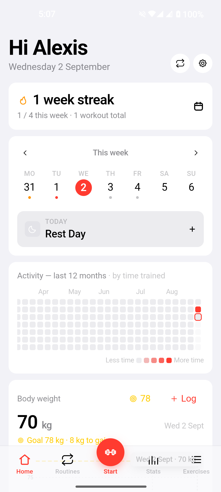
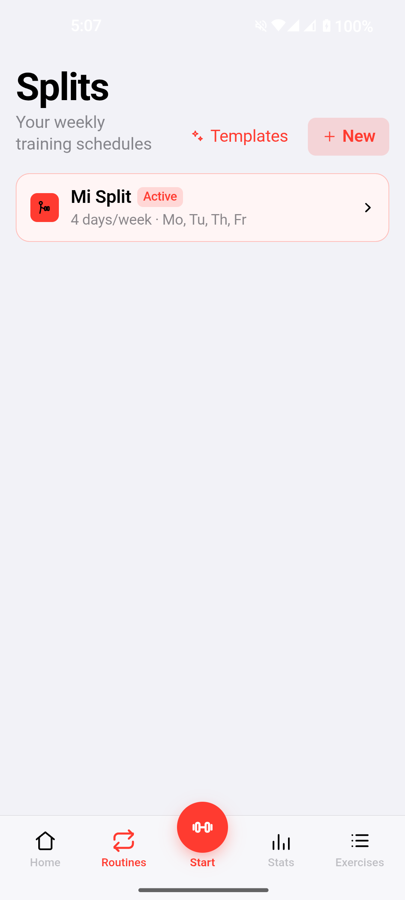
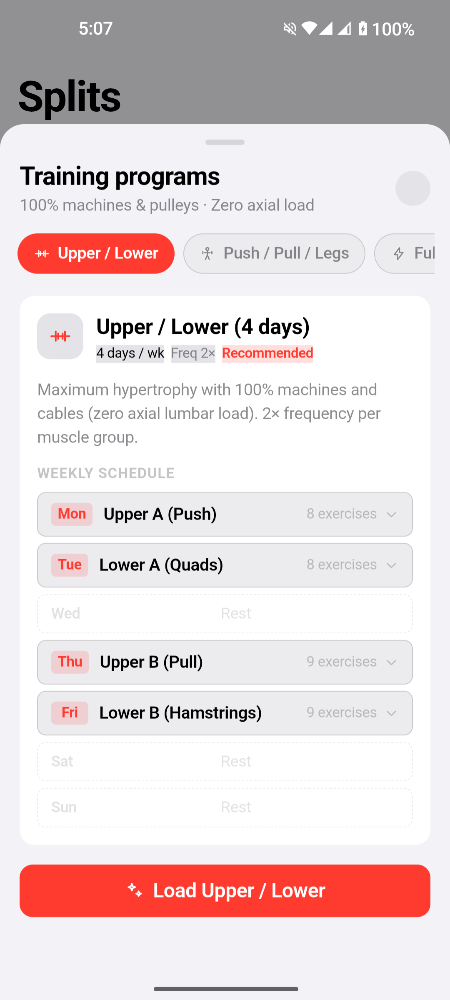
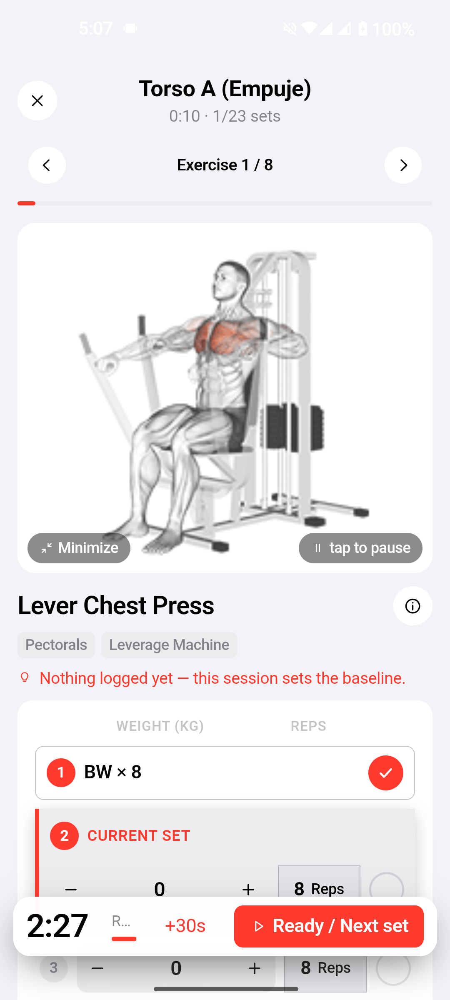
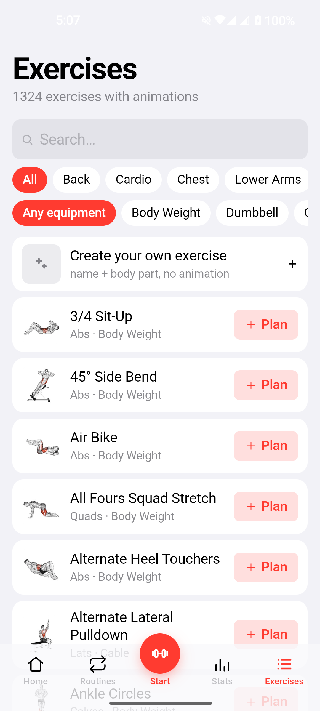
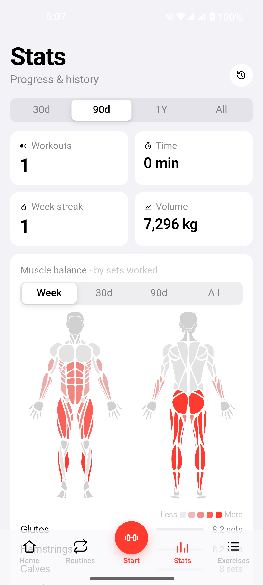

<div align="center">


<br>

**A self-hosted gym & workout tracker you actually own.**

Plan your week, run guided workouts, track every set, and monitor your body weight over time.<br>
Enhanced fork by **[Rio Futaba](https://github.com/riofutabac)** with native Android controls, real-time live notification countdowns, multi-split scheduling, and modern Appwrite BaaS sync.

<br>

> 🔀 **This is a fork.** It builds on [DuarteSantos8/openGym](https://github.com/DuarteSantos8/openGym) — full credit for the original concept and codebase to Duarte Santos. This fork adds a native Android app, an Appwrite backend you can self-host, a reworked Split/Routine scheduling model, and a full UI pass. See [Credits](#contributing--credits) for the complete breakdown.

<br>

[](LICENSE)


</div>

<br>

<div align="center">
<table>
<tr>
  <td align="center" width="33%"><br><sub><b>Home Dashboard</b><br>Weekly plan, smart rest days & weigh-ins</sub></td>
  <td align="center" width="33%"><br><sub><b>Multi-Split Manager</b><br>Create, switch & activate schedules</sub></td>
  <td align="center" width="33%"><br><sub><b>Workout Templates</b><br>Upper/Lower, PPL & curated routines</sub></td>
</tr>
<tr>
  <td align="center" width="33%"><br><sub><b>Active Workout</b><br>Live timers, steppers & RPE/RIR effort</sub></td>
  <td align="center" width="33%"><br><sub><b>Exercise Library</b><br>1,324 exercises with HD animations</sub></td>
  <td align="center" width="33%"><br><sub><b>Stats & Muscle Map</b><br>Heatmap, 1RM curves & target recovery</sub></td>
</tr>
</table>
</div>

---

## Why this Fork?

Most fitness apps lock your training data behind paywalls, cloud subscriptions, intrusive ads, or proprietary formats. 

This enhanced fork builds upon openGym's solid foundation to deliver a **first-class native mobile experience on Android**, seamless **Appwrite BaaS backend support**, and an intuitive, robust routine scheduling engine:

- 📱 **Interactive Android Notification with Native Live Chronometer**  
  Real-time countdown directly on your lock screen and notification shade using Android's native `Chronometer` (no battery drain). Includes fast actions: `+30s` rest extension, `Start set` / `Skip rest`, weight & rep steppers, and set completion—all with clean typography and zero emojis.
- 🗓️ **True Multi-Split Engine & Smart Calendar**  
  Manage multiple training splits (Upper/Lower 4-day, Push/Pull/Legs, Full Body) with one-tap activation. Unassigned split days are automatically recognized as rest days on your Home calendar, and deleting a split cleans up orphaned routines both locally and in the cloud.
- ⏱️ **Unified Rest & Advisory Work Timer**  
  A single, distraction-free bottom floating timer bar with a live countdown, progress track, and quick `+30s` button. Timed sets (planks, hangs, isometric holds) sound an alert when you reach your target, but keep counting in real-time so your exact overtime is recorded when you tap *Done*.
- ☁️ **Appwrite BaaS (Cloud or Self-Hosted)**  
  Granular per-session workout rows and profile documents in Appwrite Databases / TablesDB with strict Row-Level Security (`Role.user(uid)`). Includes a durable offline sync queue and on-device LRU media cache for HD GIF animations.
- 🎨 **Impeccable UI & Customization**  
  Sleek dark theme, clean typography, modal accent color picker with live swatches, screen wake lock during training, and 12 localized languages (including Spanish, English, German, French, and more).

---

## Features

### Workout Execution & Tracking
- **Interactive Guided Workout** — Today's session auto-loads with previous weights, target reps, rest timer, and PR detection.
- **Screen Wake Lock** — Keeps your screen awake while you train; automatically releases when you finish.
- **Effort Rating (RIR / RPE)** — Rate your sets with Reps in Reserve (0–4) or Rate of Perceived Exertion (6–10).
- **Bodyweight-Aware Steppers** — Push-ups, dips, and pull-ups log reps only, with optional added weight (`+10 kg`).
- **Timed Exercises** — Advisory work timer for planks and holds that accurately captures early stops or overtime.
- **Supersets & Cardio** — Group exercises back-to-back with rest only after the pair; log duration and speed for cardio.
- **Estimated 1RM** — Calculated per exercise from your best eligible set with progress curves and an offline calculator.

### Scheduling & Exercises
- **Multi-Split Management** — Store multiple routines and switch your active split anytime with one click.
- **Template Library** — Pre-loaded with science-based routines (e.g. 4-day zero axial load Upper/Lower, PPL, Arnold).
- **Day Overrides** — Sick, traveling, or missed a day? Swap or mark any calendar day as rest without modifying your weekly plan.
- **1,324 Exercises** — Full library searchable by name, muscle group, or equipment (barbell, cable, dumbbell, machine, bodyweight).
- **Custom Exercises** — Create your own custom exercises; seamlessly integrated into splits and stats.

### Analytics & Data Ownership
- **Activity Heatmap** — GitHub-style yearly training consistency grid.
- **Muscle Recovery Map** — Front and back anatomical figures colored by training volume over the week, month, or all-time.
- **Import from Other Apps** — One-tap migration from **Hevy**, **Strong**, **FitNotes**, or Apple Health.
- **Complete Data Export** — Instant JSON backup and restore. No telemetry, no analytics, no external tracking.

---

## Quick Start: Android APK

You can build and deploy the standalone native Android app directly to your device via [Capacitor](https://capacitorjs.com/):

### Prerequisites
- Node.js 20+
- Android Studio / Android SDK (with `platform-tools` in your `PATH`)

### Build & Install
```bash
# 1. Clone repository
git clone https://github.com/riofutabac/openGym.git
cd openGym/frontend

# 2. Install dependencies
npm install

# 3. Build web assets & sync Capacitor
npm run build:mobile

# 4. Assemble debug APK
cd android
./gradlew assembleDebug

# 5. Install to connected device (via USB / ADB)
adb install -r app/build/outputs/apk/debug/app-debug.apk
```

The APK is generated at:  
`frontend/android/app/build/outputs/apk/debug/app-debug.apk`

For the notification/Chronometer plugin internals, deep-link handling, and native Android specifics, see **[docs/MOBILE.md](docs/MOBILE.md)**. For how the pieces fit together (state store, sync queue, backend adapter), see **[docs/ARCHITECTURE.md](docs/ARCHITECTURE.md)**.

---

## Backend Setup: Appwrite BaaS

openGym supports running 100% offline (guest mode) or backed by **[Appwrite](https://appwrite.io/)** — either their managed Cloud, or a self-hosted Appwrite instance on your own server. Nothing here depends on Appwrite's cloud specifically; point `VITE_APPWRITE_ENDPOINT` at any Appwrite deployment you control.

### Environment Configuration
Copy `frontend/.env.example` to `frontend/.env`:

```env
# Enable Appwrite backend
VITE_APPWRITE=1

# Appwrite Cloud is regional — use your project's region (e.g. sfo, fra, nyc), not the
# generic cloud.appwrite.io URL, which returns 401 "Project is not accessible in this
# region". Self-hosting Appwrite yourself? Point this at your own instance's URL instead.
VITE_APPWRITE_ENDPOINT=https://<region>.cloud.appwrite.io/v1

# Your Appwrite project & database ID
VITE_APPWRITE_PROJECT_ID=your_project_id_here
VITE_APPWRITE_DATABASE_ID=opengym

# Media storage bucket for exercise GIFs (optional)
VITE_APPWRITE_BUCKET_ID=exercises
```

### Database Schema
Appwrite Databases uses two tables:
1. **`profiles`** — one row per user: settings, splits, active split, routines, bodyweight entries, and unit preferences.
2. **`workouts`** — granular, append-only rows, one per completed workout session.

Row security is enforced per user with Appwrite permissions, so on a shared instance one account can never read another's data:
```javascript
[
  Permission.read(Role.user(userId)),
  Permission.update(Role.user(userId)),
  Permission.delete(Role.user(userId)),
]
```

For the exact column list/types, the storage bucket setup, and full step-by-step deployment (including self-hosted Appwrite), see **[docs/SELF_HOSTING.md](docs/SELF_HOSTING.md)**.

---

## Web & Docker Self-Hosting

You can also run openGym as a web application or Progressive Web App (PWA):

### Local Development Server
```bash
cd frontend
npm install
npm run dev
# Open http://localhost:5173
```

### Docker Compose
```bash
docker compose up -d --build
# Open http://localhost:8080
```

---

## Tech Stack

- **UI Framework:** React 19, React Router, Zustand
- **Build Tool:** Vite
- **Mobile Engine:** Capacitor 7 (Android SDK 34+)
- **Backend / BaaS:** Appwrite Databases, Auth & Storage
- **Testing:** Vitest (370+ unit tests, run on every session with `npm test`)
- **Styling:** Custom CSS with CSS variables, dark mode & dynamic theme tokens

---

## Contributing & Credits

Contributions, issues, and ideas are welcome! Please check out [CONTRIBUTING.md](CONTRIBUTING.md).

- **Original Creator:** [Duarte Santos](https://github.com/DuarteSantos8/openGym)
- **Enhanced Fork & Mobile Overhaul:** [Rio Futaba](https://github.com/riofutabac)
- **Exercise Dataset:** [hasaneyldrm/exercises-dataset](https://github.com/hasaneyldrm/exercises-dataset)

---

## License

This project is licensed under the [GNU AGPL v3.0](LICENSE).  
Exercise animations and instructional assets remain subject to their respective original licenses (see [NOTICE.md](NOTICE.md)).
